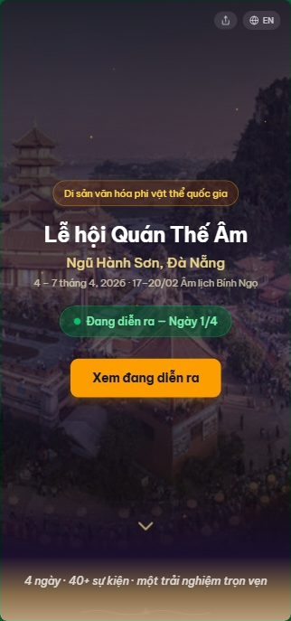
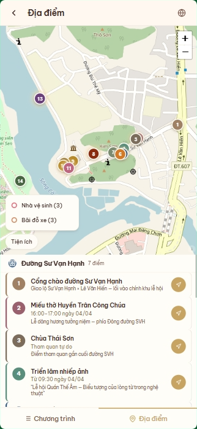

# Quan The Am Festival 2026 — Digital Map

The official digital map and schedule app for the **Quan The Am (Avalokiteshvara) Festival**, a National Intangible Cultural Heritage event held annually in Ngu Hanh Son District, Da Nang, Vietnam.

Tens of thousands of visitors attend the 4-day festival each year. This app answers the core question — **"What's happening now, and where?"** — in under 3 seconds.

**Live site:** [lehoiquantheam-nhs-danang.vn](https://lehoiquantheam-nhs-danang.vn)

<p align="center">
  
  &nbsp;&nbsp;
  
  &nbsp;&nbsp;
  
</p>
<p align="center">
  <em>Landing &nbsp;·&nbsp; Schedule &nbsp;·&nbsp; Map</em>
</p>

## Features

- **Real-time schedule** — events auto-grouped into Ongoing / Upcoming / Ended, updates every 60 seconds
- **Zone-based map** — 5 navigable zones with numbered venue pins, WC & parking toggles, GPS support
- **Bilingual** — Vietnamese and English (react-i18next)
- **Filter & favorites** — filter by day + location or category; favorite events saved to localStorage
- **Directions** — one-tap deep link to Google Maps walking directions
- **Weather** — live weather via Open-Meteo API
- **Landing page** — countdown, featured events, category highlights, practical info
- **Responsive** — 1-column + tabs on mobile, 2-column (timeline + sticky map) on tablet/desktop
- **Analytics & error tracking** — PostHog + Sentry

## Tech Stack

| Layer | Technology |
|---|---|
| Framework | React 19 (Vite) |
| Styling | Tailwind CSS v4 |
| Maps | React-Leaflet + OpenStreetMap |
| i18n | react-i18next |
| Icons | Lucide React + custom SVG pins |
| Analytics | PostHog |
| Error tracking | Sentry |
| Hosting | GitHub Pages |

## Getting Started

```bash
# Install dependencies
npm install

# Start dev server
npm run dev

# Build for production
npm run build

# Preview production build
npm run preview
```

### Environment Variables

Create a `.env` file in the project root:

```env
VITE_PUBLIC_SENTRY_DSN=your_sentry_dsn
VITE_PUBLIC_POSTHOG_KEY=your_posthog_key
VITE_PUBLIC_POSTHOG_HOST=your_posthog_host
```

These are optional for local development — analytics and error tracking are disabled in dev mode.

## Project Structure

```
src/
├── components/
│   ├── landing/       # Landing page (hero, featured events, practical info)
│   ├── layout/        # Header, tabs, weather, share, QR code
│   ├── timeline/      # Day filter, event list, event cards, detail modal
│   ├── map/           # Zone map, drill-down, pins, utility markers
│   └── icons/         # Reusable icon components
├── hooks/             # Custom hooks (filters, time grouping, favorites, GPS)
├── data/              # JSON data files + color/config maps
├── i18n/              # Translation files (vi.json, en.json)
├── utils/             # Deep links, time utilities, analytics helpers
├── App.jsx            # Root — routing, state orchestration, time simulator
└── index.css          # Tailwind @theme tokens + custom animations
```

## Data

Festival schedule, venues, and zones are stored as JSON in `src/data/`. To reuse for future years, update:

- `schedule.json` — event program (bilingual)
- `locations.json` — venue coordinates and metadata
- `zones.json` — map zone groupings
- `festivalConfig.js` — dates, year, map center

## Deployment

Pushes to `main` automatically deploy to GitHub Pages via GitHub Actions.

The workflow runs `npm ci && npm run build` and publishes the `dist/` folder.

## License

Source code is available under the [MIT License](LICENSE). Festival data, photographs, and branding belong to the Da Nang People's Committee and the Organizing Committee.

## Credits

- **Da Nang People's Committee** and the **Organizing Committee** for the official festival program
- Built with open-source tools: React, Leaflet, OpenStreetMap, Tailwind CSS, Open-Meteo
